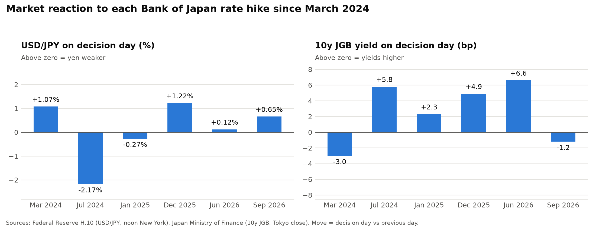

# How does the yen react to Bank of Japan rate hikes?

An event study of USD/JPY and 10-year Japanese government bond (JGB) yields around every Bank of Japan rate hike since the end of negative interest rates in March 2024.

**Status** Step 1 (measuring the market reaction to each hike) is complete. Step 2 (adding what markets expected before each meeting and the tone of each decision) is in progress, followed by a short research note and trade idea.

## The puzzle

Higher interest rates are supposed to strengthen a currency. Yet on 18 September 2026, when the BoJ raised its policy rate 25bp to 1.25% (the highest since 1995), the yen weakened and the 10-year JGB yield slipped. This project asks whether that was a one-off or a pattern, and why.

## Results so far



| Decision date | Policy rate change | USD/JPY on the day | Size vs a normal day (z) | USD/JPY over 5 days | 10y JGB on the day | 10y JGB over 5 days |
|---|---|---|---|---|---|---|
| 19 Mar 2024 | −0.1% to 0–0.1% (ended negative rates) | +1.07% | 2.7 | +1.54% | −3.0bp | −1.7bp |
| 31 Jul 2024 | 0.1% to 0.25% | −2.17% | −3.2 | −5.60%¹ | +5.8bp | −10.4bp¹ |
| 24 Jan 2025 | 0.25% to 0.5% | −0.27% | −0.6 | −1.01% | +2.3bp | +0.6bp |
| 19 Dec 2025 | 0.5% to 0.75% | +1.22% | 2.9 | +0.71% | +4.9bp | +7.0bp |
| 16 Jun 2026 | 0.75% to 1.0% | +0.12% | 1.0 | +0.84% | +6.6bp | +8.8bp |
| 18 Sep 2026 | 1.0% to 1.25% | +0.65%² | 1.0 | +1.97% | −1.2bp | +8.9bp |

USD/JPY is yen per dollar, so a **positive move means the yen weakened**. JGB moves are in basis points (1bp = 0.01 percentage points). The z column divides each day's USD/JPY move by the standard deviation of daily moves over the previous 20 trading days, so values beyond about ±2 are unusually large.

¹ The July 2024 five-day window includes the weak US jobs report on 2 August and the global unwind of yen carry trades, so it mostly reflects US and global events rather than the BoJ.
² Measured at the noon New York fix. Figures quoted at other times of day (around +0.45% in some reports) differ because of timing.

### Early observations

- **The yen weakened on the day after four of the six hikes.**
- **The yen's moves on hike days were often large in both directions.** The sell-offs in March 2024 and December 2025 were as unusual (about 3x a normal day) as the one big rally in July 2024.
- **The one big rally came in July 2024,** the hike most widely seen as not fully expected. Step 2 will check this against pre-meeting market pricing.
- **Higher Japanese yields didn't reliably support the yen.** In December 2025 and June 2026 the 10-year yield rose and the yen still weakened.
- **In September 2026 the bond market reacted with a delay.** The 10-year yield dipped on the day, then rose about 10bp over the following week.

### Candidate explanations (to be tested)

1. **Expected hikes are already priced in.** The yen may strengthen in the run-up as hike bets build, and traders then take profits once the hike is confirmed.
2. **Cautious guidance counts as a dovish surprise.** Markets price the path of future hikes, not just today's decision, so a hike with a cautious tone or dissenting votes can disappoint.
3. **The US–Japan interest-rate gap remains wide.** Borrowing yen to invest in higher-yielding dollar assets (the carry trade) still pays after a 25bp hike, so yen selling continues.
4. **Real rates remain low.** With inflation above the policy rate, Japanese savers keep moving money abroad, which means selling yen.

The working hypothesis is that the yen responds mainly to the **surprise** relative to expectations (explanations 1 and 2), while explanations 3 and 4 create a background tendency for the yen to weaken.

## Method

- **Event windows.** For each decision day *t*, the script measures the move from *t−1* to *t* (the reaction), *t−1* to *t+4* (the week) and *t* to *t+4* (follow-through after the first day).
- **Each market uses its own calendar.** JGBs don't trade on Japanese holidays, so the bond window can cover more calendar days than the FX window (for example, after 18 September 2026 it runs to 29 September).
- **Timing.** The BoJ announces around midday Tokyo time, which is late evening of the previous day in New York. The Fed's USD/JPY rate is taken at noon New York, so the *t−1* reading comes before the announcement and the *t* reading after it. JGB yields are Tokyo closing levels, also after the announcement.

## Data sources

- **USD/JPY.** Federal Reserve H.10 release via FRED (series `DEXJPUS`), noon New York buying rate.
- **10-year JGB yield.** Japan's Ministry of Finance daily benchmark yield files.

**Data check.** I first used Yahoo Finance's `JPY=X` daily closes. Compared with well-known moves, such as USD/JPY rising about 1% on 19 March 2024 and falling about 2% on 31 July 2024, the Yahoo series appeared to be shifted by one day around these events. I switched to the official Fed series, which matches those moves. The Yahoo loader remains in the script as a cross-check.

## Limitations

- **Six events is a small sample.** The patterns above are suggestive, not statistically proven.
- **Only hikes are included so far.** Meetings where the BoJ held rates can also surprise markets, so excluding them leaves out evidence.
- **Daily data blurs the reaction.** Other news on the same day affects the measured move. Intraday data would isolate the announcement more cleanly.
- **The 10-year yield is set by the market, not the BoJ.** It reflects expectations of policy over the next decade, as well as other factors such as government borrowing.

## Run it yourself

```
pip install -r requirements.txt
python bojstudy.py
```

The script writes the results table (CSV and Excel) and the chart to `results/`, and caches the raw data in `data/`. Set `REFRESH = False` to rerun from the cached data offline.

## Next steps

1. **Measure the run-up.** Add the USD/JPY and 2-year JGB yield moves over the 10 trading days before each meeting, to test whether hikes were priced in beforehand.
2. **Add meeting context.** Record pre-meeting market expectations, the tone of the statement and press conference, the vote split, and other major events in each window.
3. **Extend to every BoJ meeting** since March 2024, not just hikes.
4. **Write it up** as a short research note with a USD/JPY trade idea.
